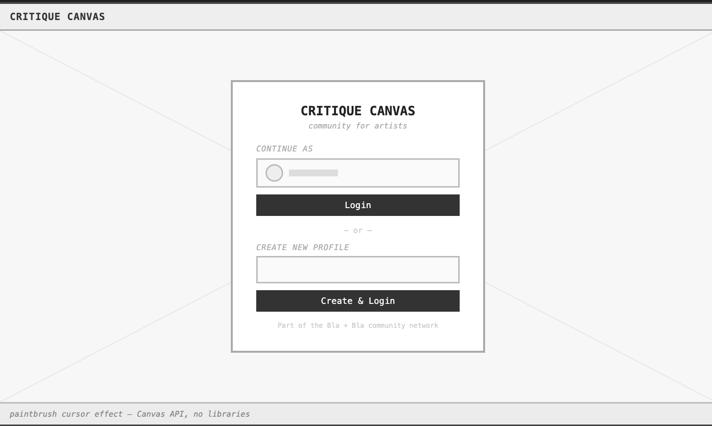
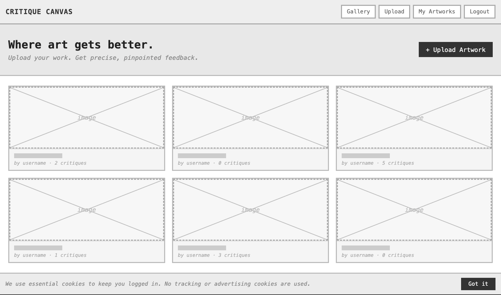

Post 1 — Interpreting the brief, identifying the community, and exploring early ideas

The BlaBla Corp brief asks us to build a "community hub", a site where people with a shared interest can come together and connect. On the surface that sounds straightforward. But when we started reading it carefully, we realised the brief is asking something more specific like it wants a hub that is tailor-made for a community, one that reflects what matters to that particular group. Generic social features are not enough. The hub needs to be shaped around a real, specific needs, targeting these specifc group of people. 

So our first question was  "who are we building for, and what do they actually need that they cannot get in other websites starting from the community rather than the feature is what stops you from building something generic.

### Choosing the community

 The problem we keep seeing in the art community and experiencing is that feedback on creative work is almost always vague and disconnected from the actual work. Someone posts a drawing on Reddit or Instagram and gets "looks great!" or "the colours are off" with no indication of where or why. There is no way to point at the specific part of the image being discussed.

This felt like a real, specific, unsolved problem that a community website could actually fix. So we decided to design for visual artists.. painters, illustrators, digital artists (maybe photographers we still discussing if we need to add any other group of people without making the webiste super broad) anyone who creates visual work and wants meaningful, located feedback on it. The community is well defined by a shared pain point, not just a shared interest.

# Early ideas we explored

Before landing on the annotation idea, we explored several other directions and other comminuties  including a Skincare Science Lab and a Film Feeling Community map, as well as a skill-swap matching system and a collaborative story feature. We moved away from these because some depended on external APIs or pre-built datasets that felt out of scope, others introduced complexity we could not realistically manage this semester. None of them addressed the specific pain point we had identified for visual artists.

# The idea we are pursuing: Critique Canvas

The idea we landed on is a click-to-annotate feedback layer. Members upload their artwork. Other members can click anywhere on the image to leave a comment anchored to that exact spot. The feedback is spatial, tied to the specific part of the image being discussed  rather than floating in a comment box with no visual connection to the work.

This is not just a feature we liked. It is the feature this community's core need demands. Every other requirement, the gallery, the upload form, the user dashboard  exists to support it.

# Core requirements we have identified so far

From this framing, we identified what the hub must have to be worth building at all, things without which it fails its purpose entirely:

- Members can upload artwork and have it displayed in a shared gallery
- Members can click on an image to leave feedback anchored to that exact location
- All feedback is stored persistently and attributed to the person who wrote it
- The interface works on both desktop and mobile viewports

And a secondary tier — features that strengthen the experience but are not load-bearing for the core proposition:

- Filtering annotations by critique category (composition, colour, anatomy, etc.)
- A toggle to mark artwork as open or closed for critique
- A personal dashboard showing uploaded artworks and critique counts

The distinction between these two tiers matters. If we run out of time, cutting something from the secondary list does not break the hub. Cutting anything from the core list does.

### What we still do not know

At this stage we are still exploring whether this is actually buildable. The brief requires us to use MojoJS, SQLite, and HTMX, and we are not yet certain how click coordinates translate into stored data and back into pinned positions on a screen. That is a technical question we have not answered yet.

The brief also sets out minimum standards that will shape every decision from here: AA accessibility compliance, EU cookie policy, responsive design for desktop and mobile, and load times under 3 seconds. A click-based spatial interaction raises real accessibility questions — what happens for users who cannot use a mouse? We have not worked that out yet, and it might turn out to be a significant constraint on how the feature can be designed. These are the questions we are taking into next week.

