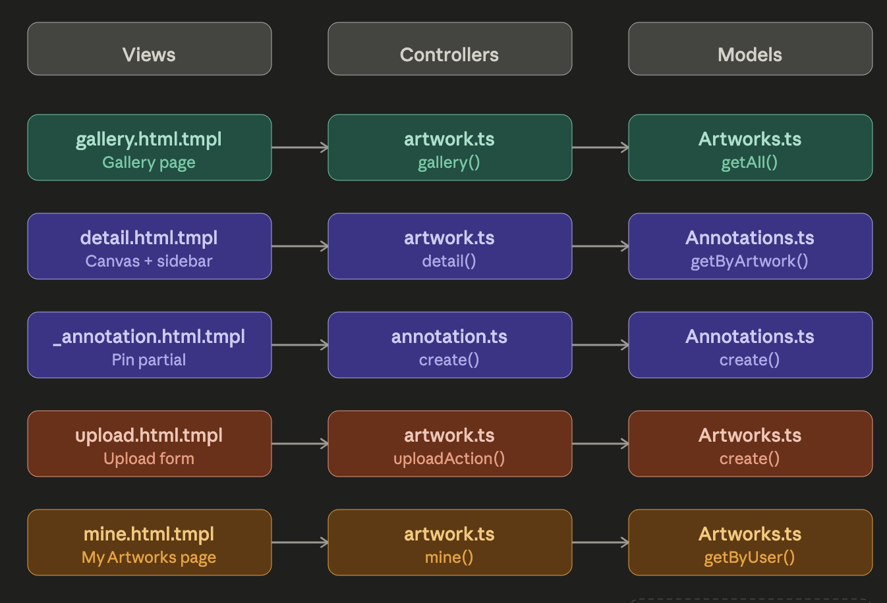
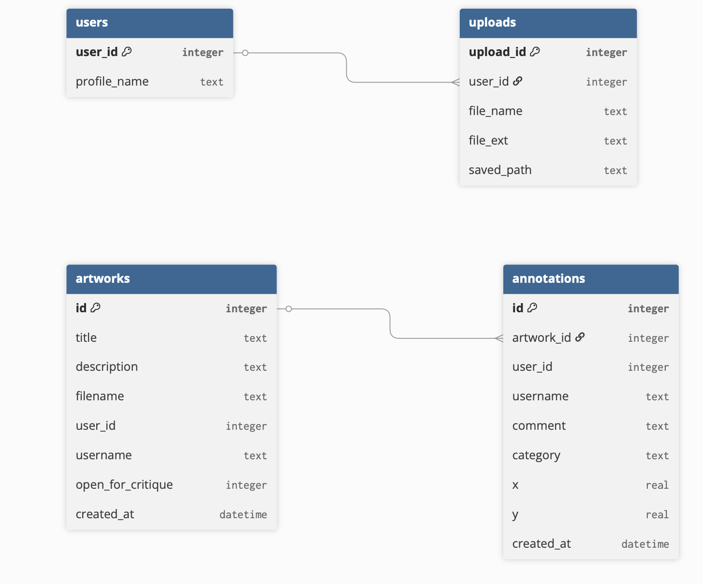

 Post 2 — Solving the coordinate problem ,Justifying schema decisions and Mapping each requirement to a technology

Post 1 defined what the application was supposed to do. This post figures out if it is actually buildable, and how each requirement maps to a specific technical decision. The big question was: what happens at each step from the moment a user clicks on an image to a pin showing up on screen?

# The coordinate problem — and why pixels won’t work

The spatial annotation requirement is immediately a data problem. A click event fires at a pixel location relative to the viewport. That means if you store those raw pixel values, an annotation on a 1200px desktop image is completely out of place when that same image is rendered at 375px on mobile. This would contravene the basic requirement on any device other than the one used to create the annotation.

The answer is to keep the coordinates in percentages not pixels. When the user clicks the image, the browser uses getBoundingClientRect() to calculate the click position relative to the canvas wrapper and divides the offset by the width and height of the wrapper to get a value between 0 and 100. These are written into two hidden form inputs before HTMX submits the form.  The server stores them as x REAL and y REAL in the annotations table . REAL rather than INTEGER, because rounding decimal coordinates to whole numbers would introduce visible positioning errors at small scales. When rendering, those percentage values are applied directly as CSS left and top on each pin, so the pin always sits in the right proportional position no matter how the image scales.

# How each part of the stack handles a specific requirement
- JavaScript (inline in the detail template) — listens for clicks on the canvas wrapper, gets x and y as percentages using getBoundingClientRect(), writes them into hidden inputs and positions the popup near the click point. This is a small self contained calculation. No external library needed.

- HTMX - submits the annotation form to the server and replaces the response into the annotation list without a full page reload, so the new annotation appears immediately. The same pattern is used for category filtering, where each filter pill triggers a GET request with a category query parameter, and HTMX swaps the returned partial into the sidebar

- MojoJS — Receives the POST, reads the x, y, comment and category values, writes to the database via the annotations model and returns a single annotation partial. Reads the category query parameter and returns a filtered list partial for filter.

- SQLite – each annotation is persisted against a foreign key back to its artwork, enforcing that an annotation cannot exist without a valid artwork to belong to.

- MojoJS templates — render each pin using stored x and y values as inline CSS percentage positioning on the canvas wrapper.

# Schema decisions and why

annotations.artwork_id → artworks.id [FOREIGN KEY]
user_id in both → BlaBla Corp session cookie (no local users table)

- The category is automatically set to 'general' because making people choose a category every time they make an annotation would be annoying. The critique should be easy to do. If we have a default then people can use the feature without having to make a choice every time.

- We store the username in each row because BlaBla Corp handles users on a different system.So there is no list of users on our system to compare with. It makes sense to store the username when we first write the data because that way we do not have to look up the username on a system every time we show the data.

- We keep images on the computers file system. Store the path in the database. If we stored the images themselves in the database it would make the database a lot bigger.It would be harder to show the images using MojoJS. It is simpler and faster to store the path and use the image as a regular file.

- We use a number for open_for_critique of just yes or no because SQLite does not have a type for yes or no answers. So we use 1 or 0. Switch, between them using a special SQL command, which is what people usually do with SQLite.

# One compliance requirement added to scope

Designing the schema made a gap in the Post 1 requirements visible: annotations store user-generated text tied to a user ID  that is personal data under GDPR. Users must be able to delete their own annotations. This is not a usability feature,it is a legal obligation under the right to erasure. It has been added to core requirements and needs a delete route in the implementation.

The upload form displays a 10MB maximum as guidance, but this is not yet enforced on server-side. A file size check in the upload route is an outstanding requirement, without it, large uploads could push the detail page past the brief's 3-second load time limit.